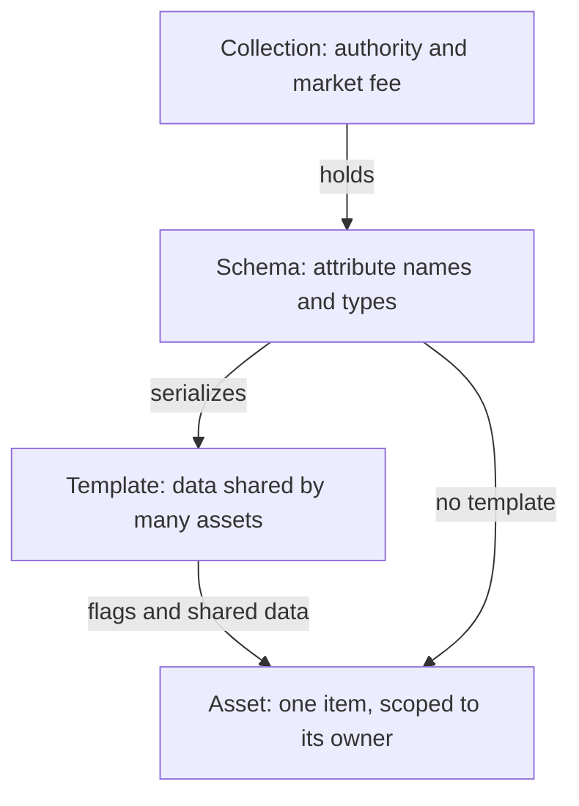

# Why an asset has four levels

An item on AtomicAssets is not one row. It is a row at each of four levels, and the split is there to make two things cheap: storage, and the decision about who is allowed to write.

## What each level owns

A collection is the top-level grouping. Every schema, template, and asset belongs to exactly one collection, and the collection's `authorized_accounts` list is the boundary that decides who may create or edit any of them. The collection also carries the `market_fee` that AtomicMarket reads at settlement.

A schema is an ordered list of attribute names and types. It never holds a value. Templates and assets in the collection serialize their data against it, and it can only ever be appended to, because a value is stored by its position in that list rather than by its name.

A template holds the data that many assets share, so that data is stored and paid for once instead of once per asset. That is the cost argument the level exists for. A template also fixes the `transferable` and `burnable` flags for everything minted from it.

An asset is one owned item. It carries its collection and schema, fixed at mint, its own immutable data set once, and its own mutable data an authorized editor can replace later.

See [AtomicAssets data model structure](../reference/atomicassets/structure.md) for the full field list at each level, and [AtomicAssets tables](../reference/atomicassets/tables.md) for the column-by-column reference.

## The levels are not one chain of ownership

Templates are optional. `mintasset` takes `template_id = -1` and mints an asset that carries only its own data, which is why the diagram above has an edge that skips the template entirely.

Template ids come from one counter for the whole contract, not one per collection, so a template id is unique everywhere and says nothing about which collection it belongs to on its own.

The scopes do not nest the way the picture suggests. Collections sit in a table scoped to the contract account, schemas and templates are scoped to their collection, and assets are scoped to their current owner. That last one is the consequential one: there is no index from a collection to its assets on chain, so listing everything in a collection is something the hosted API does by joining across owners, not something a chain read can do. See [Query the API and chain tables](../guides/querying-the-api.md#read-chain-tables-with-get_table_rows) ("Read chain tables with get_table_rows").

## Inheritance means two different things

The word covers two mechanisms that behave differently, and confusing them is the usual first mistake.

The `transferable` and `burnable` flags are inherited by the chain. An asset minted from a template takes those flags, and the contract enforces them: a transfer of an asset whose template says `transferable: false` fails.

Attribute data is not inherited by the chain at all. Each table stores its own layer as raw bytes and the contract never merges them. A template's immutable value for a key wins over an asset-level value for the same key, but that ranking is applied by whatever reads the chain, not by the contract. An indexer, an API, or a client library deserializes each layer and combines them. See [Attribute data precedence](../reference/atomicassets/data-precedence.md) for the ordering and for what a reader has to implement.

## Next

- [AtomicAssets data model structure](../reference/atomicassets/structure.md) is the reference behind every claim on this page.
- [Attribute data precedence](../reference/atomicassets/data-precedence.md) settles a name collision between two layers.
- [Mint your first asset on testnet](../tutorials/first-collection.md) builds one of each level in order.
