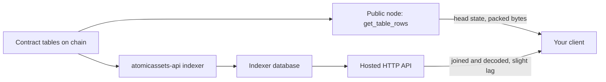

# Two ways to read the same state

Everything in this ecosystem is readable twice: straight off the chain, or through the hosted indexer that follows the chain. They answer different questions, and neither needs a credential.

## Neither path asks for a key

There is no API key to obtain, no account to create, and no registration step on the read path. A key signs a transaction, and nothing about reading needs one. That is worth knowing before you design around an onboarding step that does not exist. See [Build a session and sign](../guides/signing.md#reads-need-no-key-no-account-and-no-registration) ("Reads need no key, no account, and no registration").

## What a chain read is good for

`get_table_rows` against a public node gives you head state with nothing in between. It is the right read when you need to know what is true right now, and it is the only read that is authoritative rather than derived.

Its limit is the scoping. The `assets` table is scoped by owner and carries no collection or template index, so there is no chain-side path from a collection to the assets in it without already knowing every owner. Reading one specific asset works fine, given its owner as the scope. Enumerating a collection does not. See [Query the API and chain tables](../guides/querying-the-api.md#read-chain-tables-with-get_table_rows) ("Read chain tables with get_table_rows") for that and for the numeric-key and large-integer traps that come with it.

## What the hosted API is good for

The indexer reads the chain into a database and serves it over HTTP, which is what makes the queries a chain read cannot do possible: filtering assets by collection or template, joining an asset to its template and schema, and returning attribute data already decoded.

Three properties come with that. The market list routes cap `limit` at 100 on the reference deployment and reject a larger value with HTTP 400 rather than clamping it, so paging code bounds the value and uses `page`. Rate limiting is a deployment setting, present on the reference deployment and absent where an operator has not configured it. And the data is behind the chain by however far the indexer is behind, which is small but never zero. See [atomicassets-api HTTP API](../reference/api.md) and [atomicassets-api indexer](../reference/atomicassets-api.md).

## Why a raw row is not readable on its own

A chain read hands back attribute data as a byte array, and nothing in that byte array is self-describing. The format stores a position number and a raw value per attribute, and keeps the names and types once, in the schema. Decoding means walking the schema's format list in step with the bytes.

So a reader that goes straight to the chain has to fetch the schema too, and keep it current, because a schema can be extended. That is the work the hosted API is doing for you when it returns a `data` object instead of a byte array. See [AtomicAssets attribute serialization](../reference/atomicassets/serialization.md#serializing-and-deserializing-off-chain) ("Serializing and deserializing off-chain").

Writing is the easy direction. An off-chain caller building an action does not need the codec at all: it sends the attribute map as ordinary action data and the contract serializes it.

## Next

- [Query the API and chain tables](../guides/querying-the-api.md) is the working reference for both paths, with the host table for testnet.
- [AtomicAssets attribute serialization](../reference/atomicassets/serialization.md) is the wire format, if you are writing the decoder.
- [@atomichub/atomicassets SDK](../reference/sdk/atomicassets.md) has both readers and the codec already written.
