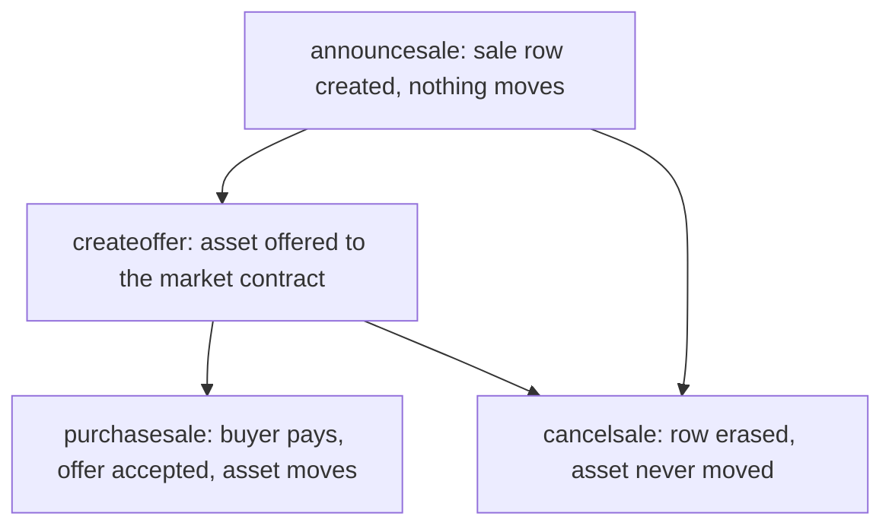

# Working with sales

The full lifecycle of an AtomicMarket instant sale (V2 baseline): announcing, escrowing the asset through an AtomicAssets offer, purchasing, cancelling, and Delphi Oracle-priced sales that list in one token and settle in another.

A sale is a lazy-accept escrow: `announcesale` only records a row, it never moves the asset. The asset stays in the seller's account until a buyer calls `purchasesale`, which accepts the underlying AtomicAssets offer and transfers the asset in the same transaction. Multiple live sale rows for the same asset are therefore valid chain state, typically a stale listing left by a previous owner after a transfer or an earlier purchase, or listings from one seller covering different asset bundles that share an asset. An indexer showing several listings for one asset is faithfully mirroring the chain; reconcilers should not delete them as drift.

Purchases and bids draw on the buyer's AtomicMarket balance rather than moving tokens directly. See [Balances and deposits](deposits.md) for the transfer-with-memo deposit flow and balance mechanics; this guide only shows where a step requires a sufficient balance. Each write below runs through a `session` built in [Build a session and sign](signing.md).



## Announce a sale

`announcesale` creates the sale row. It moves nothing: the asset stays with the seller until the escrow offer is created and accepted.

```json
{
  "seller": "sellerwaxacc",
  "asset_ids": ["1099511627887"],
  "listing_price": "100.00000000 WAX",
  "settlement_symbol": "8,WAX",
  "maker_marketplace": "mymarket"
}
```

```ts
await session.transact({
  actions: [
    {
      account: "atomicmarket",
      name: "announcesale",
      authorization: [session.permissionLevel],
      data: {
        seller: session.actor,
        asset_ids: ["1099511627887"],
        listing_price: "100.00000000 WAX",
        settlement_symbol: "8,WAX",
        maker_marketplace: "mymarket",
      },
    },
  ],
});
```

Authorization: the seller.

For a Delphi-priced listing, `listing_price.symbol` and `settlement_symbol` differ (see "Delphi sales" below); for a same-token listing they must match.

Failure modes asserted in source:

- `asset_ids` must contain exactly one id: bundle (multi-asset) listings were removed in V2; list one asset per sale and batch multiple `announcesale` calls in one transaction instead.
- The same seller cannot announce a second sale for the exact same asset id (checked by hashing the sorted id list, so a size-one vector only collides with itself): cancel the existing sale first.
- The listing/settlement symbol (or pair, for Delphi listings) must be a token or pair the contract has registered via `addconftoken`/`adddelphi`.
- `listing_price.amount` must be greater than zero.
- `maker_marketplace` must be a registered marketplace (the empty string is the contract's seeded default and always valid).
- The seller must own every listed asset, the ids must be unique, and if the asset belongs to a template, the template must be transferable.

Source: `atomicmarket-contract src/atomicmarket.cpp:744-827` (`announcesale`), `atomicmarket-contract src/atomicmarket.cpp:2120-2163` (`get_collection_and_check_assets`)

## Escrow the asset: create the AtomicAssets offer

The seller activates the sale by sending a standard AtomicAssets `createoffer` to the `atomicmarket` account itself, offering the listed asset and asking for nothing back. AtomicMarket does not custody the asset before this point: it is watched for through the `lognewoffer` notification.

```json
{
  "sender": "sellerwaxacc",
  "recipient": "atomicmarket",
  "sender_asset_ids": ["1099511627887"],
  "recipient_asset_ids": [],
  "memo": "sale"
}
```

```ts
await session.transact({
  actions: [
    {
      account: "atomicassets",
      name: "createoffer",
      authorization: [session.permissionLevel],
      data: {
        sender: session.actor,
        recipient: "atomicmarket",
        sender_asset_ids: ["1099511627887"],
        recipient_asset_ids: [],
        memo: "sale",
      },
    },
  ],
});
```

Authorization: the seller (the same account that ran `announcesale`).

AtomicMarket's `atomicassets::lognewoffer` handler matches the offer to a sale by hashing `sender_asset_ids` and scanning sale rows with that hash for one whose seller equals the offer's sender, then records the `offer_id` on the sale row and emits `logsalestart`. This is the validated "lazy accept" mechanism: the sale only becomes purchasable once this offer exists, and a seller who changes their mind before this step can simply not create the offer (or cancel it) with no on-chain trace beyond the sale row itself.

Failure modes asserted in source:

- `recipient_asset_ids` must be empty: the sale offer cannot ask for anything back.
- `sender_asset_ids` must contain exactly one id: an offer for more than one asset can no longer activate a sale (only a legacy pre-V2 bundle sale row could ever match one, and those can't be purchased; see below).
- No unclaimed sale row exists with this sender as seller for this exact asset id set.
- The matched sale row already has an offer (`offer_id != -1`): a sale can only be activated once.

Source: `atomicmarket-contract src/atomicmarket.cpp:1950-2013` (`receive_asset_offer`)

### Building the listing pair with the SDK

Announcing alone lists nothing and offering alone dangles, so the two actions belong in one transaction. `@atomichub/atomicmarket` composes that pair, filling in the `sale` memo literal and the AtomicAssets contract account:

```ts
import { MarketActionBuilder } from '@atomichub/atomicmarket'

const builder = new MarketActionBuilder('atomicmarket')

const actions = builder.announceSaleActions({
  seller: session.actor.toString(),
  asset_ids: ['1099511627887'],
  listing_price: '100.00000000 WAX',
  settlement_symbol: '8,WAX',
  maker_marketplace: 'mymarket',
  assets_contract: 'atomicassets',
})
// -> [announcesale on atomicmarket, createoffer on atomicassets with memo 'sale']

await session.transact({
  actions: actions.map((a) => ({ ...a, authorization: [session.permissionLevel] })),
})
```

The composer checks nothing. Whether the settlement symbol is a supported token, whether the listing and settlement symbols are a registered pair, and whether the marketplace exists are all chain state, and each refusal is a rejected transaction rather than a silent loss. See [@atomichub/atomicmarket SDK](../reference/sdk/atomicmarket.md#the-five-composers) ("The five composers").

## Purchase a sale

```json
{
  "buyer": "buyerwaxacc",
  "sale_id": 7,
  "intended_delphi_median": 0,
  "taker_marketplace": "othermarket"
}
```

```ts
await session.transact({
  actions: [
    {
      account: "atomicmarket",
      name: "purchasesale",
      authorization: [session.permissionLevel],
      data: {
        buyer: session.actor,
        sale_id: 7,
        intended_delphi_median: 0,
        taker_marketplace: "othermarket",
      },
    },
  ],
});
```

Authorization: the buyer. The buyer's AtomicMarket balance must already cover the settlement price (`guides/deposits.md`): `purchasesale` debits the balance, it does not accept a token transfer inline.

`intended_delphi_median` only matters for a Delphi-priced sale (see below); for a same-token sale it must be `0`. `purchasesale` computes the settlement price, debits the buyer, pays out the seller/marketplaces/collection, accepts the AtomicAssets offer, and transfers the asset to the buyer, then erases the sale row, all in one action.

Failure modes asserted in source:

- The buyer cannot be the seller.
- The sale must have an offer (`offer_id != -1`) and that offer must still exist: a seller who cancelled or reused the offer invalidates the sale for purchase (though not necessarily for lookup; see cancellation below).
- `taker_marketplace` must be a registered marketplace.
- For a Delphi sale, `intended_delphi_median` must exactly match a datapoint currently in the oracle's `datapoints` table for the configured pair: a stale median (the classic "confirmed too slowly" case) throws rather than settling at a different price.
- The buyer's balance must cover the computed settlement price (see [Balances and deposits](deposits.md)).
- A legacy pre-V2 bundle sale (`asset_ids.size() > 1`) cannot be purchased at all: calling `purchasesale` on one cancels the listing (and its offer, if any) without charging the buyer. See [AtomicMarket actions](../reference/atomicmarket/actions.md#sales) ("Sales") for how every other action treats a legacy bundle row.

Optionally guard against the sale changing between when a buyer reads it and when the purchase lands, by placing `assertsale` before `purchasesale` in the same transaction:

```json
{
  "sale_id": 7,
  "asset_ids_to_assert": ["1099511627887"],
  "listing_price_to_assert": "100.00000000 WAX",
  "settlement_symbol_to_assert": "8,WAX"
}
```

`assertsale` requires no authorization and throws if the sale's current asset ids, listing price, or settlement symbol differ from what is asserted. V2 fixed a defensive bug here. See [AtomicMarket V2 changes](../reference/atomicmarket/v2-changes.md#defensive-guards-in-the-v2-contract) ("Defensive guards in the V2 contract") for the 3-iterator vs 4-iterator `is_permutation` fix behind `assertsale`'s length check.

Source: `atomicmarket-contract src/atomicmarket.cpp:896-1015` (`purchasesale`, `assertsale`), `atomicmarket-contract src/atomicmarket.cpp:2468-2515` (`calc_settlement_price`)

### Building the purchase triple with the SDK

A purchase is three actions: assert the terms, deposit the settlement quantity into the market contract's balance, then purchase against that balance. The deposit transfer belongs to the settlement token's own contract, not to AtomicMarket, and carries the memo `deposit`. `purchaseSaleActions` composes all three:

```ts
const actions = builder.purchaseSaleActions({
  buyer: session.actor.toString(),
  sale_id: '7',
  asset_ids: ['1099511627887'],
  listing_price: '100.00000000 WAX',
  settlement_symbol: '8,WAX',
  intended_delphi_median: '0',
  token_contract: 'eosio.token',
  taker_marketplace: 'othermarket',
})
// -> [assertsale, transfer on eosio.token with memo 'deposit', purchasesale]
```

Only the purchase's place in that order is fixed. It spends the deposited balance and erases the sale row `assertsale` reads, so both of the others must precede it; the assert and the deposit may swap.

The composer throws when `asset_ids` carries more than one id, unless `allow_v1_bundle_sale: true` is set. That guard exists because the bundle case is the one caller error the chain neither reverts nor refuses: under V2 `purchasesale` returns early for a multi-asset row, declining the offer and erasing it before touching any balance, while `assertsale` has already passed and the deposit has already credited the buyer. The transaction commits with the buyer paid, nothing delivered, and the tokens recoverable only through a separate `withdraw`. Set the flag only against a chain still running AtomicMarket V1, where bundles are ordinary listings. See [@atomichub/atomicmarket SDK](../reference/sdk/atomicmarket.md#the-two-bundle-opt-out-flags) ("The two bundle opt-out flags").

Source: `atomicmarket-contract src/atomicmarket.cpp:896-1015` (`purchasesale` early return on a multi-asset row); atomicmarket-sdk (v2.4.1, 437300b) src/Actions/Generator.ts:493-592 (`purchaseSaleActions`, the emitted order, the bundle throw), src/Actions/Generator.ts:578-591 (the `deposit` memo and the settlement token's own contract)

## Cancel a sale

```json
{ "sale_id": 7 }
```

```ts
await session.transact({
  actions: [
    {
      account: "atomicmarket",
      name: "cancelsale",
      authorization: [session.permissionLevel],
      data: { sale_id: 7 },
    },
  ],
});
```

Authorization: normally the seller. `cancelsale` also accepts no authorization at all (any account can submit it) when the sale is invalid: meaning any of:

- it has an offer that no longer exists (the seller cancelled it directly through AtomicAssets), or
- the seller no longer owns at least one of the listed assets, or
- it is a legacy pre-V2 bundle row (more than one asset id): every such row is unconditionally invalid under V2, since bundle listings can never be re-activated or purchased. See [AtomicMarket actions](../reference/atomicmarket/actions.md#sales) ("Sales", "Auctions", "Buyoffers") for how each action's own legacy-row handling differs.

When the sale has a live offer, cancelling it also sends a `declineoffer` to AtomicAssets as a convenience, so the escrow offer does not linger after the listing is gone.

Source: `atomicmarket-contract src/atomicmarket.cpp:838-885` (`cancelsale`)

## Delphi (oracle) sales

A Delphi sale lists in one symbol and settles in another: for example, list at a fixed USD price and settle in WAX at the current oracle rate. This requires the listing/settlement symbol pair to be registered first.

### Registering a pair: `adddelphi`

```json
{
  "delphi_pair_name": "waxpusd",
  "invert_delphi_pair": false,
  "listing_symbol": "2,USD",
  "settlement_symbol": "8,WAX"
}
```

Authorization: the `atomicmarket` contract account itself (`require_auth(get_self())`): this is an admin-only action, not something a seller or integration calls directly.

`adddelphi` looks up `delphi_pair_name` in the `delphioracle` contract's `pairs` table and cross-checks precision: for a non-inverted pair the listing symbol's precision must equal the oracle pair's quote symbol precision and the settlement symbol's precision must equal the base symbol precision; for an inverted pair the roles swap. It also rejects re-registering a listing/settlement combination that already exists, and requires the settlement symbol to already be a supported token.

Live example: reading the mainnet config's registered pairs and the underlying oracle pair:

```sh
curl -X POST https://wax.greymass.com/v1/chain/get_table_rows \
  -d '{"code":"atomicmarket","scope":"atomicmarket","table":"config","json":true,"limit":1}'
# supported_symbol_pairs includes {"listing_symbol":"2,USD","settlement_symbol":"8,WAX","delphi_pair_name":"waxpusd","invert_delphi_pair":false}

curl -X POST https://wax.greymass.com/v1/chain/get_table_rows \
  -d '{"code":"delphioracle","scope":"delphioracle","table":"pairs","json":true,"limit":1,"lower_bound":"waxpusd","upper_bound":"waxpusd"}'
```

The mainnet deployment queried above currently reports version `1.3.3` (V1); see [AtomicMarket tables](../reference/atomicmarket/tables.md#config) ("config") for the live-version caveat. The `config` and oracle `pairs`/`datapoints` table layouts are unchanged between V1 and V2, so the read above illustrates the shape correctly either way; only the settlement-side behavior documented below (single-asset listings, execution-time fees) differs.

Source: `atomicmarket-contract src/atomicmarket.cpp:120-166` (`adddelphi`), `atomicmarket-contract include/delphioracle-interface.hpp:1-67`

### How the median converts a listing price to a settlement price

`purchasesale` (and, identically, any settlement path that calls `calc_settlement_price`) resolves the price as follows:

1. If `listing_price.symbol == settlement_symbol`, the sale is not a Delphi sale: the listing price is used unchanged, and `intended_delphi_median` must be `0`.
2. Otherwise, the contract looks up the registered `SYMBOLPAIR` for the listing/settlement combination and scans the oracle's `datapoints` table (scoped to the pair name) for a row whose `median` exactly equals the caller-supplied `intended_delphi_median`. If none matches, the action throws: this is the mechanism that rejects a stale price a client read too long before submitting the transaction.
3. The settlement amount is computed from the listing amount, the intended median, and the oracle pair's `quoted_precision`, using one formula for a normal pair and the reciprocal for an inverted pair (`invert_delphi_pair`).

A client should read the current median from `datapoints` immediately before submitting `purchasesale`, and pass that exact value as `intended_delphi_median`. The table's primary key is an insertion-order id, so the highest id is the most recent datapoint:

```sh
curl -X POST https://wax.greymass.com/v1/chain/get_table_rows \
  -d '{"code":"delphioracle","scope":"waxpusd","table":"datapoints","json":true,"limit":1,"reverse":true}'
```

Source: `atomicmarket-contract src/atomicmarket.cpp:2468-2515` (`calc_settlement_price`)

### What settlement_quantity has to be

`purchasesale` spends the buyer's AtomicMarket balance, so the buyer funds it with a deposit transfer in the same transaction. The size and symbol of that transfer are `settlement_quantity`, and nothing on chain checks it: `assertsale` pins the listing terms and says nothing about the deposit. Two rules follow, and an integrator meets both before anything else about Delphi pricing matters.

| The sale | What the deposit has to be | `intended_delphi_median` |
| --- | --- | --- |
| `settlement_symbol` differs from the listing price's own symbol | `settlement_quantity` is required, and it is denominated in the settlement symbol | the exact median the purchase asserts |
| The two name one symbol | `settlement_quantity` may be omitted; a supplied one equals `listing_price` exactly | `0` |

A cross-symbol sale settles the oracle conversion of its listing price, so reusing the listing price as the deposit sends an amount in the wrong symbol. A short deposit draws the difference from whatever balance the buyer already holds, and a wrong-symbol deposit credits a balance the purchase never spends. The whole symbol decides which row applies, precision and code both, so a sale listing `30.00 WAX` against `8,WAX` names two symbols and settles through the oracle like any other cross-symbol sale.

`@atomichub/atomicmarket` enforces both rules in `purchaseSaleActions` and derives the amount for the first one: `deriveSettlementAmount(listingAmount, median, pair)` reproduces the contract's own conversion, and `formatQuantity` renders it as the quantity string the transfer needs. Reproducing the arithmetic by hand is the step to skip; deriving the exact rational floor instead of the contract's truncated double leaves the deposit a raw unit short and the purchase throws. See [@atomichub/atomicmarket SDK](../reference/sdk/atomicmarket.md#delphi-settlement-math-derivesettlementamount-and-formatquantity) ("Delphi settlement math").

Source: `atomicmarket-contract src/atomicmarket.cpp:2468-2515` (`calc_settlement_price`, the same-symbol branch and the oracle branch); atomicmarket-sdk (v2.4.1, 437300b) src/Actions/Generator.ts:106-112 (the `settlement_quantity` contract), src/Actions/Generator.ts:522-576 (both branches enforced), src/Actions/Delphi.ts:72-122 (`deriveSettlementAmount` and the truncation it reproduces)
